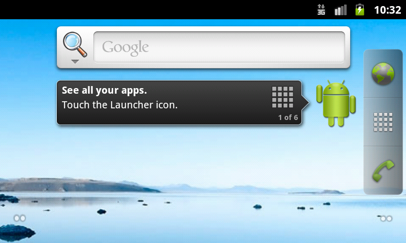
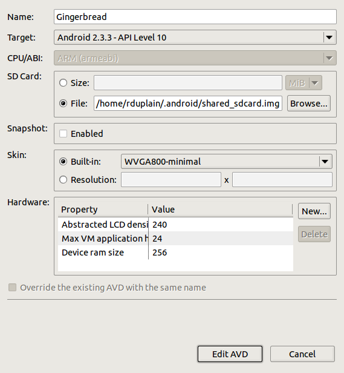

Minimal Android Emulator Skins
==============================

Overview
--------

This project contains minimalist emulator skins for the Android SDK, including
skins which start in landscape mode for keymaps which do not readily support
the Android Emulator keybindings.

Your emulator can look like this, with only window decorations your window
manager adds:

Installation
------------

In reading the Android SDK source, the only method I see for installing custom
skins is to place the skin directories you want from this repo into:

    $ANDROID_HOME/platforms/android-##/skins

... where $ANDROID_HOME is the path/to/sdk and android-## is the Android API
level package, e.g. android-10.  I looked for methods to install skins across
API levels, and it does not appear to be possible.  Specifically,
sdkmanager/libs/sdklib/src/com/android/sdklib/SdkManager.java only looks for
skins in the platforms/*/skins directory.

If your system supports symlinks, and you'd like to work out of a git checkout
of this repository, you can link to these skin directories:

    cd path/to/android/sdk/platforms/android-10/skins
    ln -s path/to/android-minimal-skins/*-minimal* .

Once installed, you can select the skin in the AVD manager.

Alternatives
------------

You can start an emulator with the `-noskin` option:

    emulator -noskin @NameOfAVD

If you are using an IDE, you can configure launch settings to pass command-line
flags to the emulator.  In my experience, the `-noskin` option also changes the
resolution scaling.  The minimal skins in this project provide complete control
over hardware settings and display resolutions.

The Android emulator supports rotating between portrait and landscape, so the
landscape skins are primarily for keymaps which do not support Android's
rotation keybindings.  Specifically, F11 or keypad 7 will rotate the emulator.
A MacBook Pro, for example, does not have a keypad and requires left control to
be pressed, typically the rotation key event is control-fn-F11.  In my
experience, this key event is not possible on a MacBook Pro running GNU/Linux
with a custom keymap, which starts to get inconvenient -- I cannot rotate the
emulator without editing my keymap.

Given I have a project which develops for custom hardware, I prefer an emulator
that starts and stays in landscape, and the WVGA800-minimal-land skin provides
just that.

